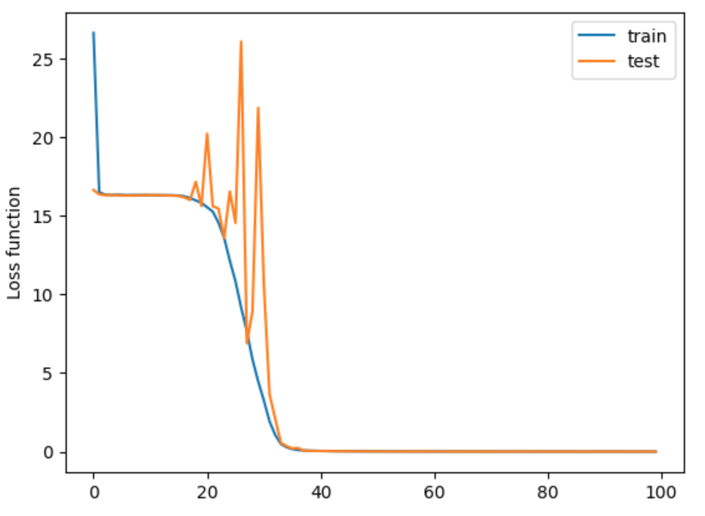
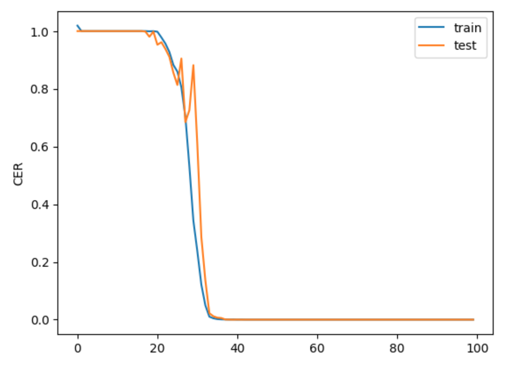

# Модель OCR для распознавания капчи

В рамках домашнего задания была реализована модель, состоящая из сверточных и LSTM слоев.

Для обучения был использован CTC лосс. 

## Метрики 
Итоговый CER < 1% (Около 0)

## Графики

CTC-Loss:

CER:

## Анализ ошибок

В процессе обучения больше всего были замечены следующие ошибки:

1) m часто определялась как n

2) 8 часто определялась как 6

3) g часто определялась как y
